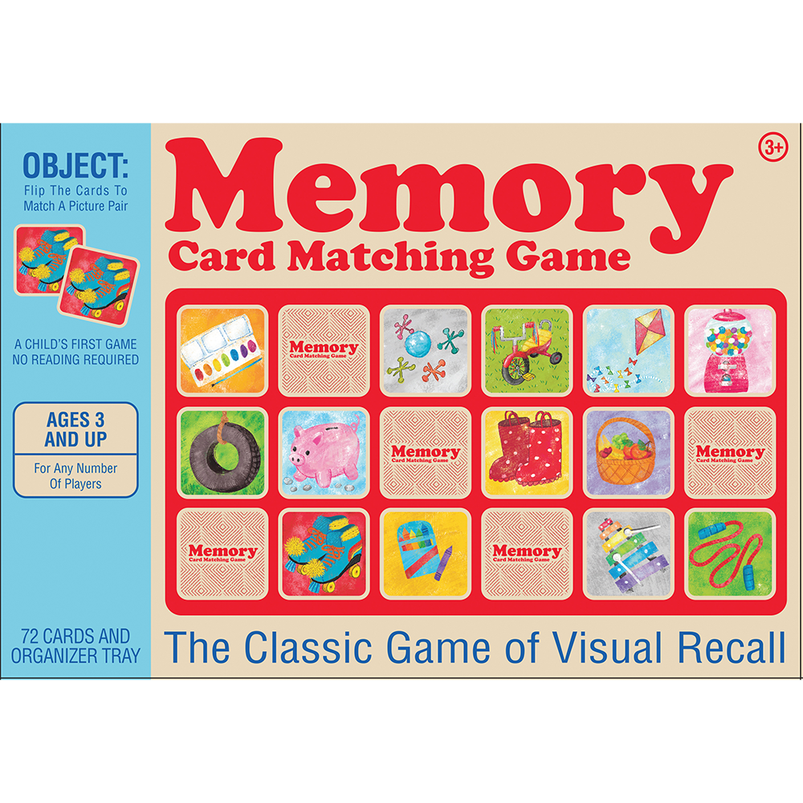

# Memory Match Game

***
## 1. Introduccion

El juego Memory Match, también conocido como _Concentration_, _Match Match_, 
_Match Up_, _Memory_, entre otros, es un juego de cartas en el que todas las 
cartas se ponen cara abajo sobre una superficie y se le dan la vuelta a dos 
cartas en cada turno. 
El objetivo del juego es destapar parejas de cartas que coincidan e ir sumando
puntos mientras un cronometro controla el tiempo que el usuario tarda en
encontrar todos los pares.

_Imagen tomada de [PlayMonster](https://www.playmonster.com/product/memory-card-matching-game/)_.

***
### Proceso de diseño

El presente proyecto fue diseñado en base a la experiencia que tuvimos luego de probar algunos
juegos similares existentes en la web, y tambien en base a las consultas realizadas a 
varias personas acerca de lo que esperarian de un juego con las caracteristicas de Memory Match.

---
### Historias de usuario

| ***HISTORIA DE USUARIO 1:*** Como jugador deseo que se me permita ingresar un nickname para que se registre mi puntaje|
|---------------------------|
||
|***CRITERIOS DE ACEPTACION***|
|Debe existir una caja de texto|
|Debe existir un boton para continuar|
|Debe ser responsive| |
|***DEFINICION DE TERMINADO***|
|Se debe poder acceder al nickname ingresado por el usuario y guardarlo en una variable|
||
| ***HISTORIA DE USUARIO 2:*** Como jugador deseo que se me permita escoger un tipo de baraja |
||
|***CRITERIOS DE ACEPTACION***|
|Se debe mostrar el tipo de barajas que se puede elegir|
|Debe existir un medio donde pueda seleccionar mi opcion|
|Debe existir un boton para continuar|
|Debe ser responsive|
|***DEFINICION DE TERMINADO***|
|Se puede acceder a la eleccion del usuario|
| ***HISTORIA DE USUARIO 3:*** Como jugador deseo que se me permita elegir un nivel de dificultad|
||
|***CRITERIOS DE ACEPTACION***|
|Se debe mostrar una lista de las opciones entre las que se puede elegir|
|Debe existir un boton para continuar|
|Debe ser responsive|
|***DEFINICION DE TERMINADO***|
|Se puede acceder a la eleccion del usuario|
| ***HISTORIA DE USUARIO 4:*** Como jugador deseo que se me permita visualizar un juego que me permita voltear cartas y buscar sus pares|
||
|***CRITERIOS DE ACEPTACION***|
|Se debe poder visualizar un tablero de cartas|
|Al dar click en una carta esta debe mostrar su contenido|
|Debe ser responsive|
|***DEFINICION DE TERMINADO***|
|El jugador ha encontrado todos los pares de las cartas mostradas|
| ***HISTORIA DE USUARIO 4:*** Como jugador deseo que se me permita ver mis resultados finales|
||
|***CRITERIOS DE ACEPTACION***|
|Se debe mostrar el tiempo que le tomo al jugador resolver el juego|
|Se debe mostar el puesto en el ranking que gano en el juego con su tiempo obtenido|
|***DEFINICION DE TERMINADO***|
|Se accede al ranking existente y al tiempo que le llevo al jugador resolverlo y se muestra en pantalla|
***
#### Prototipo de baja fidelidad

Primero se diseno un prototipo en papel, para dar forma a nuestras ideas, el cual se muestra a continuacion:

***
#### Prototipo de alta fidelidad
Tomando en cuenta los datos anteriores, se realizo un prototipo en Figma, el mismo que se muestra a continuacion:

***
#### Testeos de usabilidad - Listado de problemas

Aqui va: Incluye el listado de problemas que detectaste a través de tests de
  usabilidad
***
#### Planes de accion
(Objetivos de Aprendizaje priorizados) de cada programadora

***Gina***

***Myriam***
